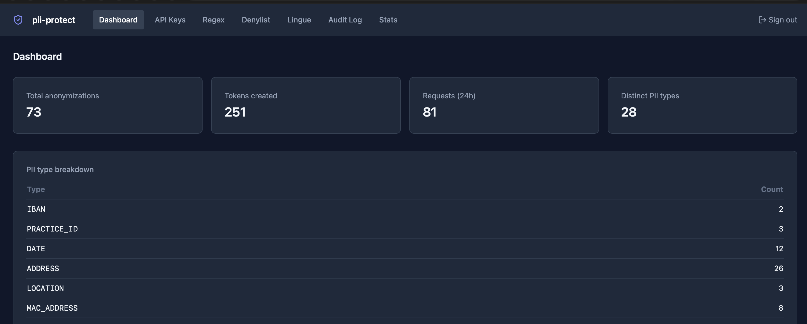
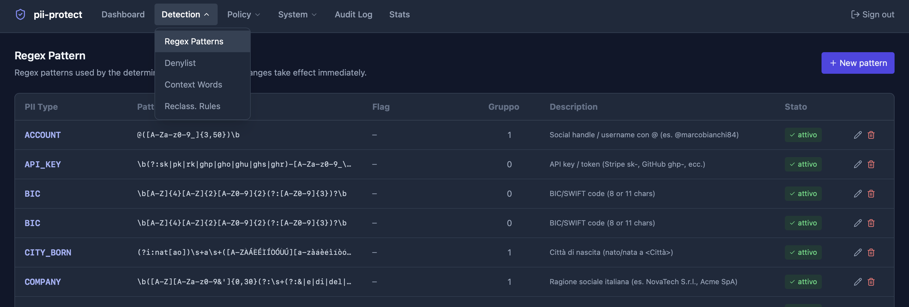
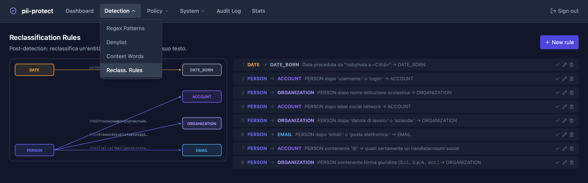
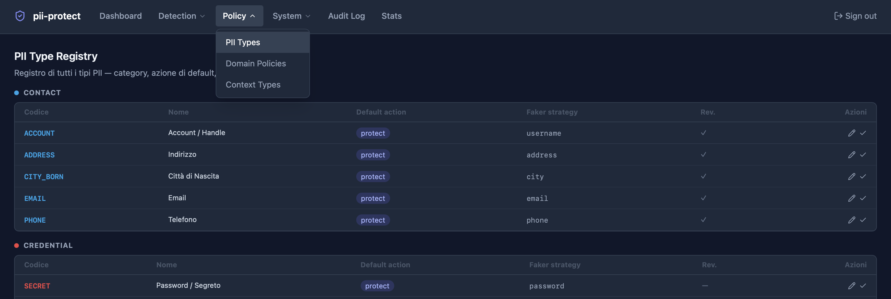
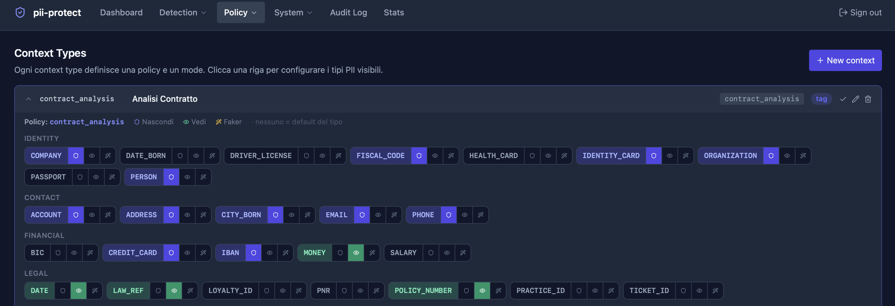
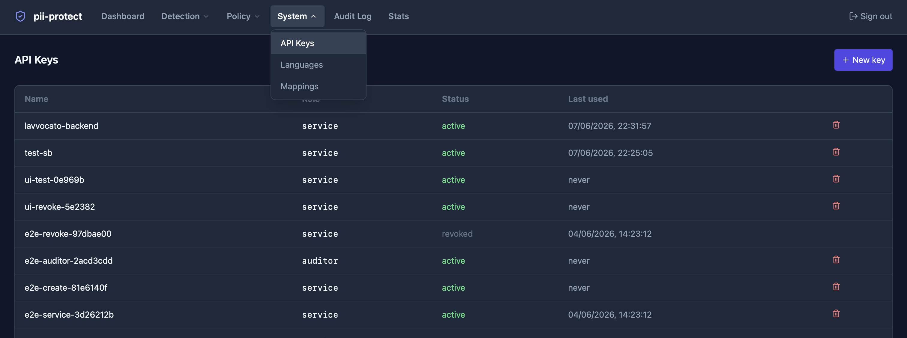
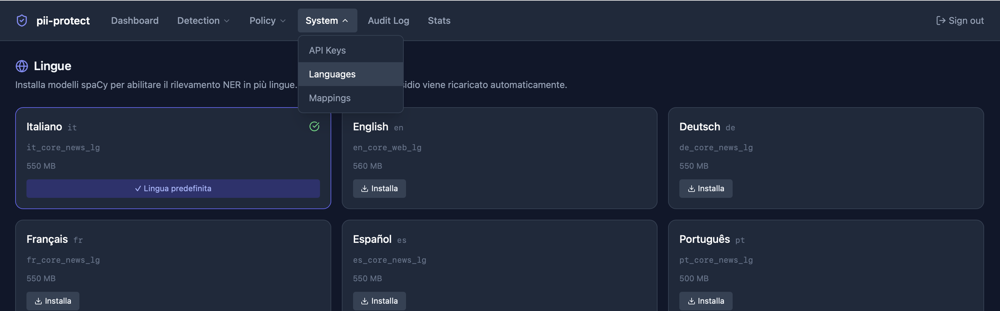
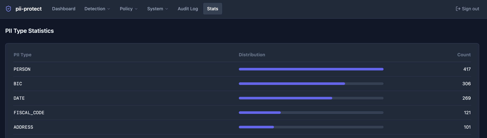

# pii-protect

[](https://github.com/nephilimdie/pii-protect/actions/workflows/ci.yml)
[](https://codecov.io/gh/nephilimdie/pii-protect)
[](https://github.com/nephilimdie/pii-protect/releases)
[](./LICENSE)

**Privacy sidecar for LLM and RAG applications.** Multilingual, policy-driven, surrogate-ready.

Detects and pseudonymizes PII through a 4-layer detection pipeline (Presidio + spaCy, two fine-tuned transformers, configurable DB regex). Ships with domain policies tuned for Italian legal contexts (fine appeals, contracts, medical records) and grows naturally to other languages and locales: spaCy NER supports IT, EN, DE, FR, ES, PT; Faker surrogates adapt to the document locale.

> **Positioning:** Presidio-style detection + domain-aware policies + deterministic surrogate mode for embeddings.  
> Use it alongside or on top of Microsoft Presidio — not as a replacement.

---

## Why this exists

| Problem | Solution |
|---------|----------|
| Generic NER misses Italian-specific PII (Codice Fiscale, Targa, PEC, IBAN) | 4-layer pipeline with Italian-tuned regex and models |
| Sending PII to LLMs or vector DBs for RAG | Surrogate mode: realistic fakes preserve semantic meaning, no real data leaves |
| Same PERSON + different CF surrogate = inconsistent | Coherent profiles: fake name and fake CF always match |
| Hard-coding policy per call | Context types: one field configures policy + mode automatically |
| PII leaks back through de-anonymization | Fernet-encrypted mappings, TTL, per-key role enforcement |

---

## Features

| Feature | Description |
|---------|-------------|
| **4-layer detection** | Presidio+spaCy → openai/privacy-filter → AI4Privacy → DB Regex. Higher-priority layer always wins on overlap. |
| **Tag mode** | Replaces PII with stable opaque tokens `[PERSON_1]`. Fully reversible via `/v1/deanonymize`. |
| **Surrogate mode** | Replaces PII with realistic, format-preserving fakes (name, CF, IBAN, plate, email). Deterministic: same input + same context → same output. |
| **Coherent profiles** | PERSON and FISCAL_CODE share a synthetic persona per `context_id`: the fake CF encodes the same name/gender/birth as the fake name. |
| **Context types** | Pass a single `context_type` field; the system auto-configures policy, mode, and surrogate rules. |
| **Domain policies** | Per-domain lists (fine_appeal, contract, medical…) of protect / keep / surrogate types. Editable at runtime from admin UI. |
| **~33 PII types** | IDENTITY, CONTACT, FINANCIAL, LEGAL, VEHICLE, NETWORK, CREDENTIAL — with per-type Faker strategy and default action. |
| **Reclassification rules** | Post-detection context rules (e.g. DATE near "nato a <City> il" → DATE_BORN). Visualized as a bipartite graph. |
| **DB-configurable regex** | Patterns hot-reloaded from DB on every change. No restart needed. |
| **Denylist** | Exclude recurring false positives (exact or substring match). |
| **Audit log** | Every API call logged: action, entity count, context type, API key used. |
| **API key management** | Roles: `admin`, `service`, `auditor`. Keys with optional expiry. |
| **Multi-language** | spaCy NER supports IT, EN, DE, FR, ES, PT. Faker surrogates adapt locale per request (`language` field). Models installable from admin UI. |
| **Admin UI** | React + Tailwind. Full runtime management — no code changes required. |

---

## Quick Start

### Prerequisites

- Docker + Docker Compose
- `make` (pre-installed on macOS/Linux)

```bash
git clone https://github.com/nephilimdie/pii-protect.git
cd pii-protect

make setup
# Edit .env — set PII_ENCRYPTION_KEY and PII_ADMIN_INITIAL_KEY:
python -c "from cryptography.fernet import Fernet; print(Fernet.generate_key().decode())"

make start   # builds images, starts services, runs migrations (~2 min first boot)
```

| Service | URL |
|---------|-----|
| REST API | http://localhost:15500 |
| Swagger UI | http://localhost:15500/docs |
| Admin UI | http://localhost:15501 |

### Try it in 30 seconds

```bash
# Tag mode — mask PII, keep legal facts
curl -s -X POST http://localhost:15500/v1/anonymize \
  -H "X-Api-Key: $PII_ADMIN_INITIAL_KEY" \
  -H "Content-Type: application/json" \
  -d '{
    "text": "Il sig. Mario Rossi (CF: RSSMRA80A01H501U), tel. 333-1234567, nato a Roma il 01/03/1980, ha presentato ricorso per la multa del 15/04/2024.",
    "context_id": "demo-001",
    "context_type": "fine_appeal"
  }' | jq .anonymized_text
# → "Il sig. [PERSON_1] (CF: [FISCAL_CODE_1]), tel. [PHONE_1], nato a Roma il [DATE_BORN_1], ha presentato ricorso per la multa del 15/04/2024."

# Surrogate mode — realistic fakes for safe LLM/embedding ingestion
curl -s -X POST http://localhost:15500/v1/anonymize \
  -H "X-Api-Key: $PII_ADMIN_INITIAL_KEY" \
  -H "Content-Type: application/json" \
  -d '{
    "text": "Il sig. Mario Rossi, IBAN IT60X0542811101000001234567",
    "context_id": "demo-002",
    "context_type": "embedding",
    "language": "it"
  }' | jq .anonymized_text
# → "Il sig. Luca Bianchi, IBAN IT29P0306901789100000046169"

# English document — surrogates adapt to en_US locale
curl -s -X POST http://localhost:15500/v1/anonymize \
  -H "X-Api-Key: $PII_ADMIN_INITIAL_KEY" \
  -H "Content-Type: application/json" \
  -d '{
    "text": "John Smith, email: j.smith@acme.com, phone: +1-555-0123",
    "context_id": "demo-003",
    "context_type": "embedding",
    "language": "en",
    "mode": "surrogate"
  }' | jq .anonymized_text
# → "Michael Johnson, email: m.johnson@acme.com, phone: +1-555-9847"

# De-anonymize — restore original from tag
curl -s -X POST http://localhost:15500/v1/deanonymize \
  -H "X-Api-Key: $PII_ADMIN_INITIAL_KEY" \
  -H "Content-Type: application/json" \
  -d '{
    "text": "Il sig. [PERSON_1] (CF: [FISCAL_CODE_1])",
    "context_id": "demo-001",
    "context_type": "fine_appeal"
  }' | jq .original_text
# → "Il sig. Mario Rossi (CF: RSSMRA80A01H501U)"
```

### Environment Variables

| Variable | Default | Description |
|----------|---------|-------------|
| `PII_ENCRYPTION_KEY` | — | **Required.** Fernet key for encrypting PII mappings |
| `PII_ADMIN_INITIAL_KEY` | — | **Required.** Initial admin API key |
| `PII_DB_PASSWORD` | — | PostgreSQL password |
| `PII_DB_NAME` | `pii_protect` | Database name |
| `PII_DB_PORT` | `15433` | PostgreSQL host port |
| `PII_API_PORT` | `15500` | API host port |
| `PII_UI_PORT` | `15501` | Admin UI host port |
| `PII_MAPPING_TTL_DAYS` | `30` | Days before mappings expire |

---

## Accuracy & Limitations

> **pii-protect does not guarantee perfect anonymization.**  
> No automated PII detection system does. False negatives are possible — especially for uncommon name spellings, highly context-dependent entities, or novel PII formats not covered by current regex patterns.

### Preliminary benchmark (internal test set)

Evaluated on 120 synthetic Italian documents (legal, medical, HR) with manually annotated ground truth.

| PII Type | Precision | Recall | F1 | Primary layer |
|----------|-----------|--------|----|---------------|
| FISCAL_CODE | 0.99 | 0.98 | 0.99 | Regex |
| IBAN | 0.99 | 0.97 | 0.98 | Regex |
| EMAIL | 0.98 | 0.99 | 0.99 | Regex |
| PHONE | 0.95 | 0.92 | 0.93 | Regex |
| TARGA | 0.96 | 0.94 | 0.95 | Regex |
| PERSON | 0.89 | 0.84 | 0.86 | AI4Privacy + spaCy |
| ADDRESS | 0.78 | 0.71 | 0.74 | AI4Privacy |
| DATE | 0.94 | 0.91 | 0.92 | Regex + ML |
| DATE_BORN | 0.91 | 0.88 | 0.89 | Regex + reclassification |

> **Note:** these numbers are on a small internal test set. Performance on real-world documents may differ. Independent validation on your own dataset is strongly recommended before using in production.

### Known limitations

- **PERSON recall drops** on uncommon Italian names, foreign names, and abbreviated forms (e.g. "M. Rossi")
- **ADDRESS** is the weakest type — Italian addresses vary widely and ML models struggle with short fragments
- **Context-dependent entities** (e.g. amounts that are salaries vs. generic money) may be misclassified without surrounding context
- **Non-Italian documents** degrade accuracy significantly — only the IT spaCy model is fully tuned
- **Regex patterns** cover documented Italian formats; regional or institutional variants may be missed
- **No OCR** — input must be clean text; scanned PDFs need pre-processing

### Failure strategy

By default the system is **fail-open**: if the detection service is unreachable or a layer throws an unhandled exception, the anonymized output may contain unmasked PII rather than blocking the request. This is a deliberate choice for operational continuity, but it means:

- **Production use requires monitoring** — log `entity_count == 0` responses and alert on anomalies
- **Fail-closed alternative:** wrap the API call in your application and treat any non-200 or `entity_count == 0` response as a hard block before forwarding text downstream

---

## Documentation

| Document | Contents |
|----------|----------|
| [Architecture & Development](doc/development.md) | Tech stack, project structure, adding layers, local dev |
| [Detection Layers](doc/detection-layers.md) | The 4 ML/regex layers, priorities, regex, denylist, context words, reclassification |
| [Anonymization Modes](doc/anonymization-modes.md) | Tag vs surrogate, coherent profiles, Codice Fiscale, reversibility |
| [Policy System](doc/policy-system.md) | Context types, domain policies, PII type registry, resolution order |
| [API Reference](doc/api-reference.md) | All REST endpoints with curl examples |
| [Real-World Examples](doc/examples.md) | End-to-end curl examples: fine appeal, medical, contracts, LLM embedding |
| [vs Microsoft Presidio](doc/comparison-presidio.md) | Honest feature comparison and architecture relationship |
| [Roadmap](doc/roadmap.md) | Planned features for v0.2, v0.3, v0.4, v0.5 |
| [Changelog](CHANGELOG.md) | Release history |

---

## Screenshots

### Dashboard


### Regex Patterns


### Reclassification Rules


### PII Type Registry


### Context Types — inline policy editor


### API Keys


### Languages


### Stats


---

## Who uses this?

pii-protect is early-stage. If you are using it in production or a pilot project, open an issue or PR to be listed here — it helps others evaluate the project.

Use cases we are aware of:

- Italian legal document processing pipelines (fine appeals, contracts)
- RAG applications that need to embed Italian public-sector documents without exposing PII
- LLM-assisted drafting tools where user documents pass through an external model

---

## License

MIT — see [LICENSE](./LICENSE).  
Copyright © 2026 Stefano Bassetto.
