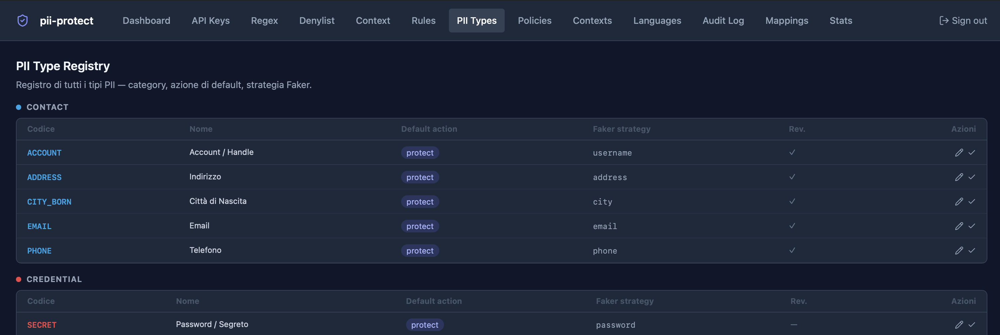

# pii-protect

Standalone PII pseudonymization microservice. Detects and anonymizes Italian personal data using a cascaded multi-layer detection pipeline. Designed as a sidecar for lavvocato but usable independently.

## Architecture

```
text input + context_type + mode
    │
    ▼
┌──────────────────────────────────────────────────────────────────────┐
│                     Policy Resolution                                │
│  context_type → domain_policy → protect_types / keep_types / mode   │
│  inline policy in request overrides DB policy                        │
└──────────────────────────────────────────────────────────────────────┘
    │
    ▼
┌─────────────────────────────────────────────────────────────────────┐
│                       DetectorRegistry                               │
│  (parallel via ThreadPoolExecutor)                                   │
│                                                                      │
│  Layer 1: Presidio + spaCy it_core_news_lg    priority=10            │
│  Layer 2: openai/privacy-filter (ONNX)        priority=20            │
│  Layer 3: Isotonic/distilbert ai4privacy      priority=25            │
│  Layer 4: Regex patterns (from DB)            priority=30            │
│                                                                      │
│  EntityMerger: overlaps resolved by score; Regex (1.0) wins          │
└─────────────────────────────────────────────────────────────────────┘
    │
    ▼
Reclassification (context/entity rules from DB)
    │
    ▼
Policy filter: keep_types pass through unchanged
    │
    ▼
┌──────────────────────────────────────────────────────────────────────┐
│  mode = tag        │  mode = surrogate                               │
│  [PERSON_1]        │  Faker IT, deterministic (hash seed)            │
│  [CF_1]            │  PERSON → "Luca Bianchi"                        │
│  reversible        │  FISCAL_CODE → "BNCLCU85M12F205X" (valid CF)    │
│                    │  profiles: PERSON+CF coherent per context_id    │
└──────────────────────────────────────────────────────────────────────┘
    │
    ▼
encrypted mapping (PostgreSQL) + audit log
    │
    ▼
anonymized text + entity list + mode used
```

**Domain layout:**

```
api/app/
├── detection/          # PII detection (Strategy + Registry + Provider)
│   ├── contracts/      # DetectorContract ABC
│   ├── layers/         # One file per detection layer
│   ├── entities.py     # PiiEntity dataclass
│   ├── detector_registry.py
│   └── detector_provider.py   ← only file to touch when adding a new layer
├── anonymization/      # Pseudonymization logic + Fernet encryption
├── surrogates/         # Format-preserving fake value generation
│   ├── cf_codec.py     # Italian Codice Fiscale encoder/decoder
│   ├── generators.py   # Faker IT generators per PII type
│   ├── surrogate_service.py  # DB-backed deterministic surrogate cache
│   └── policy_service.py     # Policy + mode resolution
├── identity/           # API key auth, roles
├── audit/              # Audit log
└── reporting/          # Stats endpoint
```

---

## Quick Start

### Prerequisites

- Docker + Docker Compose
- `make` (pre-installed on macOS/Linux)
- Python 3.11+ (for local dev only)

### One-command startup

```bash
make setup   # creates .env from .env.example (skipped if .env already exists)
# → edit .env: set PII_ENCRYPTION_KEY and PII_ADMIN_INITIAL_KEY
make start   # build images + start services + run migrations
```

Available commands:

```
make setup     copy .env.example → .env (skip if .env exists)
make start     build images + start all services + run migrations
make stop      stop all services
make restart   stop → start
make migrate   run Alembic migrations
make logs      tail API logs
make test      run pytest inside the API container
make clean     stop + remove volumes (destructive)
```

### Manual startup (without make)

**1. Configure**

```bash
cp .env.example .env
```

Generate the Fernet encryption key:

```bash
python -c "from cryptography.fernet import Fernet; print(Fernet.generate_key().decode())"
```

Edit `.env`:

```env
PII_ENCRYPTION_KEY=<generated Fernet key>
PII_ADMIN_INITIAL_KEY=<choose a strong admin key>
PII_DB_PASSWORD=<choose a strong DB password>
```

**2. Start services**

```bash
docker compose up --build -d
```

| Service | Default URL |
|---------|-------------|
| REST API | http://localhost:15500 |
| API Docs (Swagger) | http://localhost:15500/docs |
| Admin UI | http://localhost:15501 |
| PostgreSQL | localhost:15433 |

**3. Migrations**

Run automatically at boot via `entrypoint.sh`. No manual step needed.

**4. First login**

On first boot the API creates an admin API key from `PII_ADMIN_INITIAL_KEY`. Open http://localhost:15501 and enter it.

---

## Configuration

| Variable | Default | Description |
|----------|---------|-------------|
| `PII_ENCRYPTION_KEY` | — | **Required.** Fernet key for encrypting PII mappings |
| `PII_ADMIN_INITIAL_KEY` | — | **Required.** Initial admin API key |
| `PII_DB_NAME` | `pii_protect` | PostgreSQL database name |
| `PII_DB_USER` | `pii_protect` | PostgreSQL user |
| `PII_DB_PASSWORD` | — | PostgreSQL password |
| `PII_DB_PORT` | `15433` | PostgreSQL host port |
| `PII_API_PORT` | `15500` | API host port |
| `PII_UI_PORT` | `15501` | Admin UI host port |
| `PII_SPACY_MODEL` | `it_core_news_lg` | spaCy model |
| `PII_PRIVACY_FILTER_MODEL` | `openai/privacy-filter` | ONNX privacy-filter model |
| `PII_AI4PRIVACY_MODEL` | `Isotonic/distilbert_finetuned_ai4privacy_v2` | AI4Privacy model |
| `PII_MAPPING_TTL_DAYS` | `30` | Days before mappings expire |

---

## API Reference

Full OpenAPI spec at http://localhost:15500/docs.

All endpoints (except `/health`) require `X-Api-Key` header.

### Roles

| Role | Permissions |
|------|-------------|
| `admin` | Full access |
| `service` | Anonymize and deanonymize |
| `auditor` | Read-only stats and audit log |

---

### `POST /v1/anonymize`

Roles: `service`, `admin`

```json
{
  "text": "Il sig. Mario Rossi, CF: RSSMRA80A01H501U, tel: 333-1234567",
  "context_id": "case_file_uuid",
  "context_type": "fine_appeal",
  "mode": "tag",
  "policy": {
    "protect": ["PERSON", "FISCAL_CODE", "PHONE"],
    "keep": ["DATE", "MONEY", "TARGA"]
  }
}
```

`context_type` drives policy and default mode automatically. `mode` and `policy` in the request override the context defaults.

| Field | Required | Description |
|-------|----------|-------------|
| `text` | yes | Text to anonymize |
| `context_id` | yes | Session/document identifier for mapping storage |
| `context_type` | yes | Named context (see Context Types) — drives policy and mode |
| `mode` | no | `tag` (default) or `surrogate` — overrides context default |
| `policy` | no | Inline `{protect:[...], keep:[...]}` — overrides domain policy |
| `language` | no | ISO code, defaults to `default_language` setting |

**mode = tag** (default):
```json
{
  "anonymized_text": "Il sig. [PERSON_1], CF: [FISCAL_CODE_1], tel: [PHONE_1]",
  "entity_count": 3,
  "pii_types_found": ["PERSON", "FISCAL_CODE", "PHONE"],
  "mode": "tag",
  "entities": [...]
}
```

**mode = surrogate** — format-preserving realistic fake values:
```json
{
  "anonymized_text": "Il sig. Luca Bianchi, CF: BNCLCU85M12F205X, tel: +39 02 1234567",
  "mode": "surrogate",
  "entities": [...]
}
```

Surrogates are deterministic within the same `context_id`: the same real value always produces the same fake value. PERSON and FISCAL_CODE are generated as a coherent profile (fake name + valid derived CF).

---

### `POST /v1/deanonymize`

Roles: `service`, `admin`

```json
{
  "text": "Il sig. [PERSON_1], CF: [FISCAL_CODE_1]",
  "context_id": "case_file_uuid",
  "context_type": "fine_appeal"
}
```

---

### Admin endpoints

| Method | Path | Description |
|--------|------|-------------|
| `GET` | `/v1/admin/context-types` | List context types |
| `POST` | `/v1/admin/context-types` | Create context type |
| `PUT` | `/v1/admin/context-types/{code}` | Update context type |
| `DELETE` | `/v1/admin/context-types/{code}` | Delete context type |
| `GET` | `/v1/admin/domain-policies` | List domain policies |
| `PUT` | `/v1/admin/domain-policies/{domain}` | Upsert domain policy |
| `DELETE` | `/v1/admin/domain-policies/{domain}` | Delete domain policy |
| `GET` | `/v1/admin/pii-types` | List PII type registry |
| `PUT` | `/v1/admin/pii-types/{code}` | Update PII type defaults |
| `GET` | `/v1/admin/reclassification-rules` | List reclassification rules |
| `POST` | `/v1/admin/reclassification-rules` | Create rule |
| `PUT` | `/v1/admin/reclassification-rules/{id}` | Update rule |
| `DELETE` | `/v1/admin/reclassification-rules/{id}` | Delete rule |
| `GET` | `/v1/admin/regex-patterns` | List regex patterns |
| `POST` | `/v1/admin/regex-patterns` | Create pattern |
| `PUT` | `/v1/admin/regex-patterns/{id}` | Update pattern |
| `DELETE` | `/v1/admin/regex-patterns/{id}` | Delete pattern |
| `GET` | `/v1/admin/denylist` | List denylist entries |
| `POST` | `/v1/admin/denylist` | Add entry |
| `PUT` | `/v1/admin/denylist/{id}` | Update entry |
| `DELETE` | `/v1/admin/denylist/{id}` | Delete entry |
| `GET` | `/v1/admin/presidio-context` | List context words |
| `POST` | `/v1/admin/presidio-context` | Add context word |
| `PUT` | `/v1/admin/presidio-context/{id}` | Update |
| `DELETE` | `/v1/admin/presidio-context/{id}` | Delete |
| `GET` | `/v1/admin/audit-log` | Paginated audit log |
| `DELETE` | `/v1/admin/audit-log/bulk` | Bulk delete audit entries |
| `GET` | `/v1/admin/mappings` | Paginated token mappings |
| `DELETE` | `/v1/admin/mappings/bulk` | Bulk delete mappings |
| `GET` | `/v1/admin/stats` | Usage statistics |
| `GET` | `/v1/admin/languages` | Installed spaCy models |
| `POST` | `/v1/admin/languages/{code}/install` | Install language |
| `GET/PUT` | `/v1/admin/settings` | Default language setting |
| `GET` | `/v1/auth/api-keys` | List API keys |
| `POST` | `/v1/auth/api-keys` | Create API key |
| `DELETE` | `/v1/auth/api-keys/{id}` | Revoke API key |

---

## Context Types

Context types are the main entry point for callers. Each context type has:

- **Domain policy** — which PII types to protect and which to keep unchanged
- **Default mode** — `tag` (opaque token) or `surrogate` (realistic fake value)

Pre-seeded context types:

| Code | Display name | Domain | Default mode |
|------|-------------|--------|-------------|
| `default` | Default | default | tag |
| `fine_appeal` | Ricorso Multa | fine_appeal | tag |
| `contract_analysis` | Analisi Contratto | contract_analysis | tag |
| `medical` | Documenti Medici | medical | tag |
| `hr` | HR / Lavoro | default | tag |
| `legal_brief` | Atto Legale | contract_analysis | tag |
| `embedding` | Embedding Esterno | default | surrogate |

Create custom context types via the admin UI or `PUT /v1/admin/context-types`.

---

## Domain Policies

A domain policy defines which PII types to protect (anonymize) and which to keep (leave as-is) for a given use case.

Pre-seeded policies:

| Domain | Protect | Keep |
|--------|---------|------|
| `fine_appeal` | PERSON, CF, EMAIL, PHONE, ADDRESS, IBAN, IDENTITY_CARD, DRIVER_LICENSE | DATE, MONEY, LAW_REF, **TARGA**, PRACTICE_ID, TICKET_ID |
| `contract_analysis` | PERSON, CF, EMAIL, PHONE, ADDRESS, IBAN, CREDIT_CARD, **TARGA**, COMPANY | DATE, MONEY, LAW_REF, POLICY_NUMBER |
| `medical` | PERSON, CF, EMAIL, PHONE, ADDRESS, **HEALTH_CARD** | DATE, MONEY, LAW_REF, PRACTICE_ID |
| `default` | all identity/contact/financial types | DATE, MONEY, LAW_REF, URL, GPS |

Note: `TARGA` is kept in `fine_appeal` (needed for the appeal) but protected in `contract_analysis`.

---

## Surrogate Mode

When `mode=surrogate`, PII is replaced with format-preserving realistic fake values instead of opaque tokens.

| Real value | Surrogate |
|-----------|-----------|
| `Mario Rossi` | `Luca Bianchi` |
| `RSSMRA80A01H501U` | `BNCLCU85M12F205X` (valid CF) |
| `mario.rossi@pec.it` | `luca.bianchi@pec.it` |
| `IT60X0542811101000001234567` | `IT29P0306901789100000046169` |
| `+39 333 1234567` | `+39 02 9876543` |
| `AB123CD` (targa) | `FG456HI` |

**Properties:**

1. **Consistent** — same real value → same surrogate within a `context_id`. The LLM sees "Luca Bianchi" everywhere, not a different name each time.
2. **Format-preserving** — CF stays a valid 16-char CF, IBAN stays a valid IBAN, targa stays a valid plate format.
3. **Coherent profiles** — PERSON and FISCAL_CODE share a profile: the fake CF encodes the same fake name, gender, birth date, and city as the fake PERSON.
4. **Reversible** — the surrogate→real mapping is stored per `context_id` for de-anonymization when needed.

**Determinism:** surrogates are generated by seeding Faker IT with `sha256(real_value|context_id)`. Same inputs → same output, no DB lookup needed for generation. The DB acts as a cache and supports de-anonymization.

---

## Reclassification Rules

Post-detection rules that change an entity's type based on context. Applied after all detection layers merge their results.

Each rule has:
- **FROM** — source PII type
- **TO** — target type (empty = discard entity)
- **Context pattern** — regex searched in the N chars before the entity
- **Entity pattern** — regex searched in the entity text itself
- If both patterns are set, both must match (AND logic)

Pre-seeded rules:

| FROM | TO | Condition |
|------|----|-----------|
| PERSON | ACCOUNT | entity contains `@` |
| PERSON | ACCOUNT | context has `username:` / `login:` |
| PERSON | ACCOUNT | context has social network label |
| PERSON | EMAIL | context has `email:` |
| PERSON | ORGANIZATION | context has `datore di lavoro:` / `azienda:` |
| PERSON | ORGANIZATION | context has school/institute label |
| PERSON | ORGANIZATION | entity contains legal suffix (S.r.l., S.p.A.) |

Manage from the admin UI under **Rules**.

---

## PII Type Registry

Central registry of all recognized PII types. Each type has:

- **Category**: IDENTITY, CONTACT, FINANCIAL, LEGAL, VEHICLE, NETWORK, CREDENTIAL
- **Default action**: `protect` or `keep`
- **Faker strategy**: which generator to use in surrogate mode
- **Reversible**: whether de-anonymization is supported

Managed from the admin UI under **PII Types**.



---

## Detection Layers

### Layer 1 — Presidio + spaCy `it_core_news_lg`
PERSON, EMAIL, PHONE, IBAN, FISCAL_CODE, DATE

### Layer 2 — openai/privacy-filter (ONNX quantized)
PERSON, EMAIL, PHONE, ADDRESS, DATE, SECRET

### Layer 3 — Isotonic/distilbert_finetuned_ai4privacy_v2
PASSWORD, USERNAME, ACCOUNT_NUMBER, CREDIT_CARD, CVV, PIN, IBAN, BIC, MAC_ADDRESS, IP_ADDRESS, GPS_COORDINATE, URL, TARGA, PERSON, ADDRESS, DATE, EMAIL, PHONE

### Layer 4 — Regex patterns (DB-configurable)
FISCAL_CODE, IBAN, EMAIL, PHONE, TARGA, PIVA, CREDIT_CARD, MAC_ADDRESS, IP_ADDRESS, GPS_COORDINATE, HEALTH_CARD, PRACTICE_ID, TICKET_ID, POLICY_NUMBER, IMEI, PNR, ACCOUNT, API_KEY, BIC, CITY_BORN, COMPANY, SALARY

Regex patterns are stored in PostgreSQL and hot-reloaded on change. Manage from the admin UI under **Regex**.

---

## Adding a New Detection Layer

Three steps:

**1. Create the layer file** — `api/app/detection/layers/<your_layer>.py`

```python
from app.detection.contracts.detector_contract import DetectorContract
from app.detection.entities import PiiEntity

class MyCustomDetector(DetectorContract):
    @property
    def layer_name(self) -> str: return "my_custom"

    @property
    def priority(self) -> int: return 40  # after Regex (30)

    def detect(self, text: str, language: str = "it") -> list[PiiEntity]:
        return []  # never raise, return [] on failure

    def is_available(self) -> bool: return True
```

**2. Register in `detector_provider.py`**

```python
from app.detection.layers.my_layer import MyCustomDetector
# inside build():
registry.register(MyCustomDetector())
```

**3. (Optional) Add to env config for runtime toggle**

```env
PII_DETECTION_LAYERS={"my_custom":{"enabled":true},...}
```

---

## Local Development

```bash
cd api
python -m venv .venv && source .venv/bin/activate
pip install -r requirements.txt
python -m spacy download it_core_news_lg

docker compose up postgres -d
uvicorn app.main:app --reload --port 15500
```

---

## Integration with lavvocato

Three call patterns depending on the use case:

**Generation (chat / ricorso) — tag mode:**
```http
POST /v1/anonymize
{ "text": "...", "context_id": "...", "context_type": "fine_appeal" }
```
Protects identity data, keeps legal facts (date, importo, targa, articolo). De-anonymize output before showing to user.

**Embedding (external vector DB) — surrogate mode:**
```http
POST /v1/anonymize
{ "text": "...", "context_id": "...", "context_type": "embedding" }
```
Replaces PII with realistic surrogates. The embedding captures semantic meaning without real personal data. No de-anonymization needed for similarity search.

**Custom per-request policy:**
```http
POST /v1/anonymize
{
  "text": "...",
  "context_id": "...",
  "context_type": "fine_appeal",
  "policy": { "protect": ["PERSON","FISCAL_CODE"], "keep": ["DATE","MONEY","TARGA"] }
}
```

Store `context_id` + `context_type` alongside anonymized text. Pass both to `/v1/deanonymize` to restore.

---

## Tech Stack

| Component | Technology |
|-----------|-----------|
| API | FastAPI + SQLAlchemy async |
| Database | PostgreSQL (pgvector) |
| NER Layer 1 | Microsoft Presidio + spaCy `it_core_news_lg` |
| NER Layer 2 | `openai/privacy-filter` (ONNX quantized, CPU) |
| NER Layer 3 | `Isotonic/distilbert_finetuned_ai4privacy_v2` |
| NER Layer 4 | Regex patterns (DB, hot-reloaded) |
| Surrogates | Faker IT (deterministic seed) + CF codec |
| Admin UI | React + Vite + Tailwind CSS |

---

## About

**pii-protect** is an open-source project by [Stefano Bassetto](https://github.com/nephilimdie).

Built to solve a real need: sending legal documents through AI pipelines without exposing personal data.

### Design principles

- **Fail-open** — if unreachable, the calling app continues rather than breaking
- **Deterministic last word** — regex (score 1.0) always wins over probabilistic models on the same span
- **Zero vendor lock-in** — all models run locally; no data leaves your infrastructure
- **Operator-controlled** — patterns, policies, rules, and API keys are all manageable at runtime
- **Context-driven** — one `context_type` field drives policy, mode, and behaviour

---

## License

MIT — see [LICENSE](./LICENSE).
Copyright © 2026 Stefano Bassetto.
