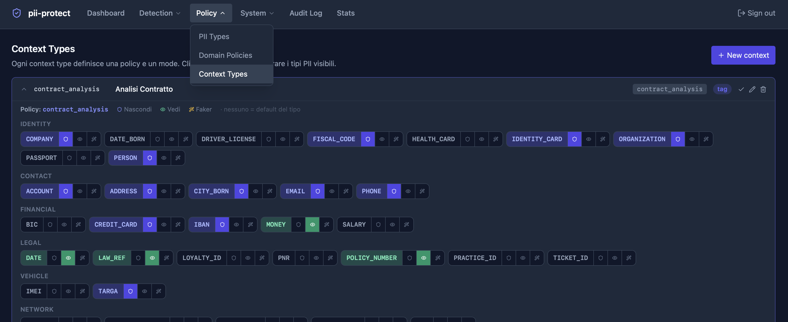

# Policy System

← [README](../README.md)

The policy determines **what to do** with each detected PII type. It is configured across three hierarchical levels:

```
Context Type
    ↓ points to
Domain Policy  →  protect_types / keep_types / surrogate_types
    ↓ fallback
PII Type Registry  →  default_action per type
```

---

## PII Type Registry

Central registry of all PII types recognized by the system (~33 types).

Each type has:

| Field | Description |
|-------|-------------|
| `code` | Identifier (e.g. `FISCAL_CODE`) |
| `category` | `IDENTITY`, `CONTACT`, `FINANCIAL`, `LEGAL`, `VEHICLE`, `NETWORK`, `CREDENTIAL` |
| `display_name` | Human-readable name |
| `default_action` | `protect`, `keep`, or `redact` — used when no policy overrides it |
| `faker_strategy` | Faker generator to use in surrogate mode |
| `reversible` | Whether the surrogate can be de-anonymized |
| `enabled` | Enable/disable the type globally |


Manage from **Policy → PII Types**.

### Types by category

| Category | Types |
|----------|-------|
| IDENTITY | PERSON, FISCAL_CODE, DATE_BORN, CITY_BORN, PASSPORT, IDENTITY_CARD, DRIVER_LICENSE, HEALTH_CARD |
| CONTACT | ACCOUNT, ADDRESS, EMAIL, PHONE |
| FINANCIAL | BIC, CREDIT_CARD, IBAN, MONEY, SALARY |
| LEGAL | DATE, LAW_REF, LOYALTY_ID, POLICY_NUMBER, PRACTICE_ID, PNR, TICKET_ID |
| VEHICLE | IMEI, TARGA |
| NETWORK | API_KEY, GPS_COORDINATE, IP_ADDRESS, MAC_ADDRESS, URL |
| CREDENTIAL | SECRET |

---

## Domain Policies

A domain policy defines, for a given application domain, which PII types to:
- **Protect** (🛡 hide) — anonymized with tag or surrogate
- **Keep** (👁 show) — left unchanged in the text
- **Surrogate** (✨) — always replaced with a fake value, even if the context type is in `tag` mode
- **Unassigned** — follows the type's `default_action` from the registry

### Pre-loaded policies

| Domain | Protect | Keep |
|--------|---------|------|
| `default` | All IDENTITY, CONTACT, FINANCIAL types | DATE, MONEY, LAW_REF, URL, GPS |
| `fine_appeal` | PERSON, CF, EMAIL, PHONE, ADDRESS, IBAN, IDENTITY_CARD, DRIVER_LICENSE | DATE, MONEY, LAW_REF, **TARGA**, PRACTICE_ID, TICKET_ID |
| `contract_analysis` | PERSON, CF, EMAIL, PHONE, ADDRESS, IBAN, CREDIT_CARD, **TARGA**, COMPANY | DATE, MONEY, LAW_REF, POLICY_NUMBER |
| `medical` | PERSON, CF, EMAIL, PHONE, ADDRESS, **HEALTH_CARD** | DATE, MONEY, LAW_REF, PRACTICE_ID |

> `TARGA` is in **keep** for `fine_appeal` (the plate is part of the case file) but in **protect** for `contract_analysis`.

Manage from **Policy → Domain Policies**.

---

## Context Types

Context types are the pipeline entry point. The caller passes a single `context_type` field and the system automatically configures policy and mode.

| Field | Description |
|-------|-------------|
| `code` | String to pass as `context_type` in the API call |
| `display_name` | Human-readable name in the admin UI |
| `domain` | Linked domain policy (FK → `domain_policies`) |
| `default_mode` | `tag` or `surrogate` — used unless overridden in the request |
| `enabled` | Enable/disable the context type |

### Pre-loaded context types

| Code | Domain | Mode | Typical use |
|------|--------|------|-------------|
| `default` | default | tag | Generic |
| `fine_appeal` | fine_appeal | tag | Traffic fine appeals |
| `contract_analysis` | contract_analysis | tag | Contract analysis |
| `medical` | medical | tag | Medical documents |
| `hr` | default | tag | Human resources |
| `legal_brief` | contract_analysis | tag | Legal briefs |
| `embedding` | default | **surrogate** | Text for LLM/vector DB |




Clicking a row in the Context Types page opens the inline policy editor: assign each PII type to protect/keep/faker without leaving the page.

Manage from **Policy → Context Types**.

---

## Policy resolution — precedence order

```
1. Inline policy in the request body   (highest priority)
2. Domain policy of the context_type
3. default_action of the type in the PII registry (fallback)
```

`mode` follows the same logic:
```
1. mode in the request body
2. default_mode of the context_type
3. "tag" (global fallback)
```

---

## Inline override in the request

```json
{
  "text": "...",
  "context_id": "uuid",
  "context_type": "fine_appeal",
  "mode": "surrogate",
  "policy": {
    "protect":   ["PERSON", "FISCAL_CODE"],
    "keep":      ["DATE", "TARGA"],
    "surrogate": ["EMAIL", "PHONE"]
  }
}
```

The inline override completely replaces the domain policy linked to the context type.
